# Лабораторная работа №1

## Запуск keycloak на ВМ1

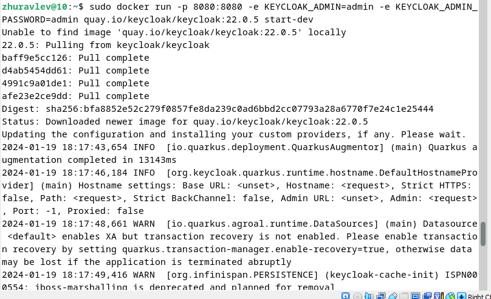
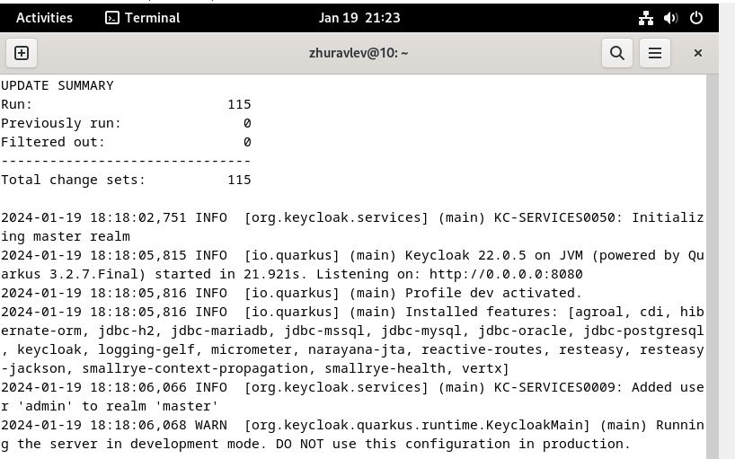

## Проходим авторизацию

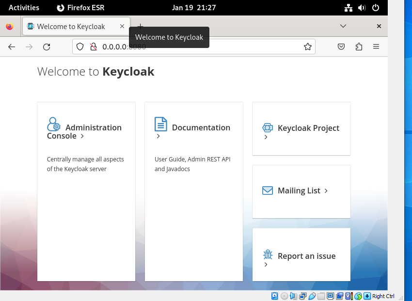
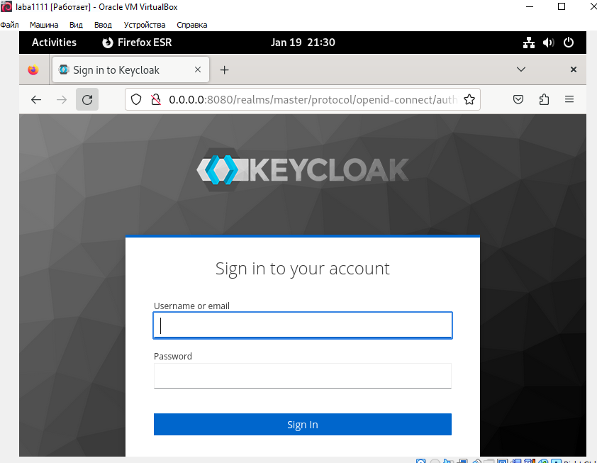

## Создаем реалм

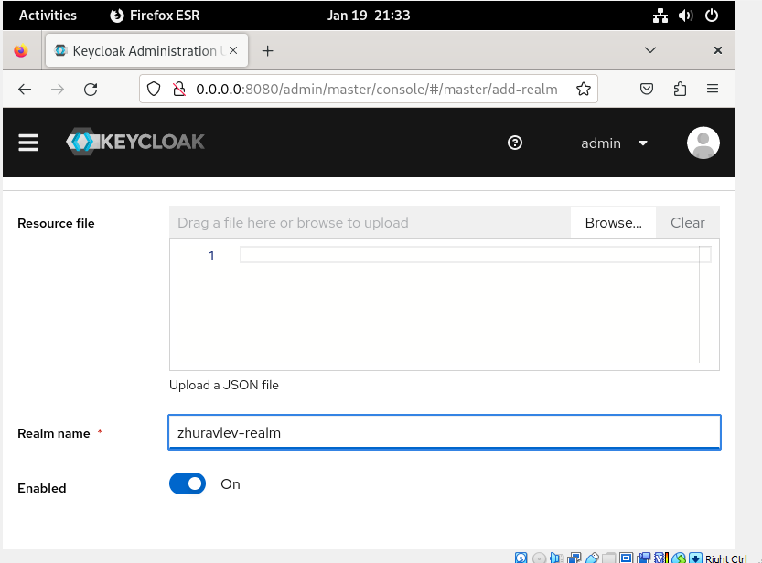
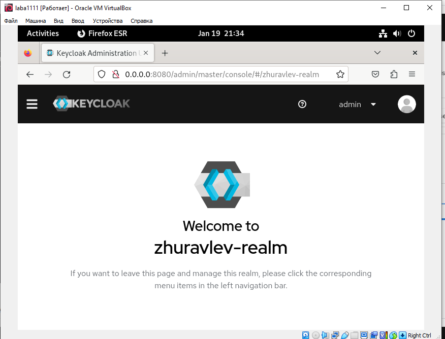

## Добавляем пользователей 

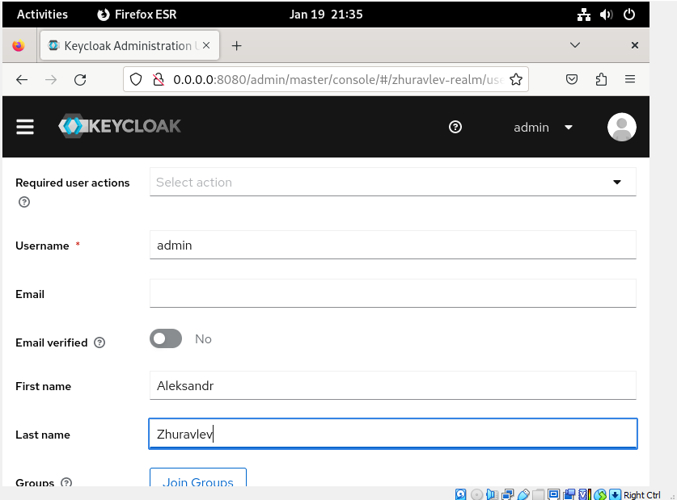
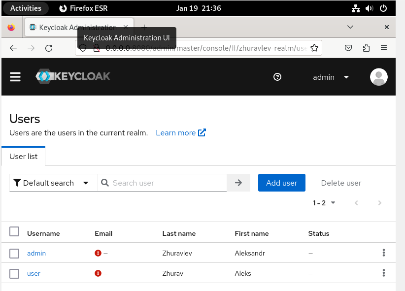

## Был выбран JupyterHub для реализации аунтификации на ВМ2

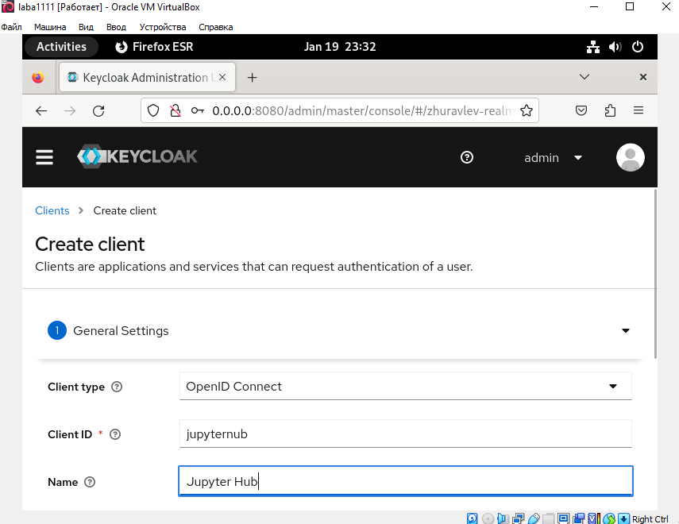

## Скрипт для соединения

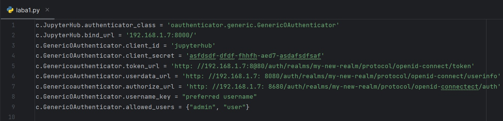

## Запускаем сервер

## Настраиваем авторизацию OTP

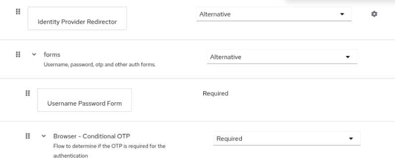

## Предложение добавить запись в OTP клиент

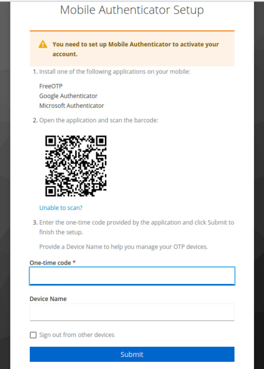

