# Практическое задание №4.2 Контроль целостности

## Загрузка OS Astra Linux

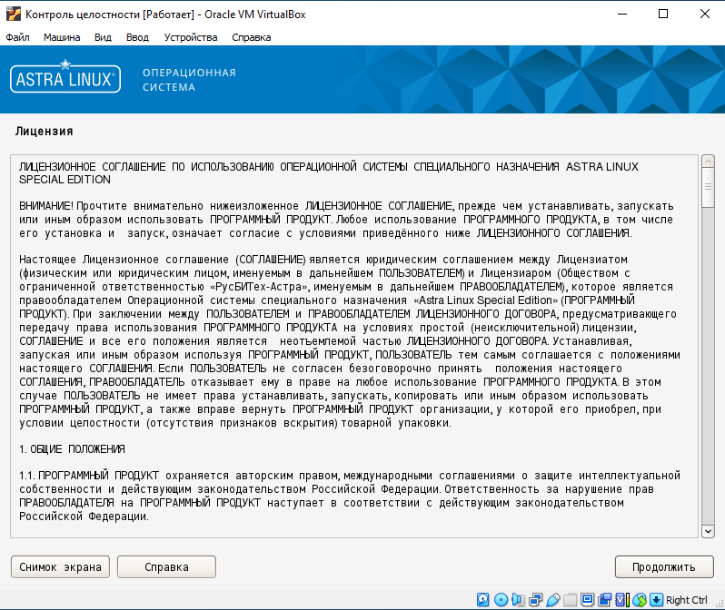

## Выбираем максимальный уровень защищенности "Смоленск"

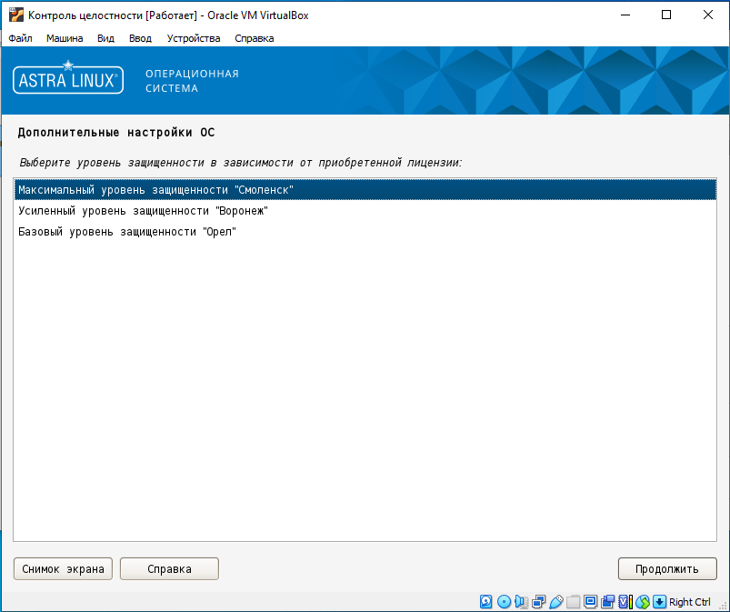

## Включаем мандатный контроль целостности

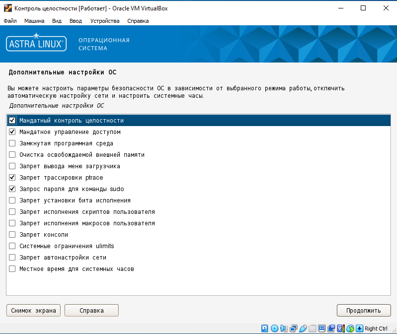

## Проверка работы мандатного контроля целостности

## Присваиваем метку доступа созданному файлу

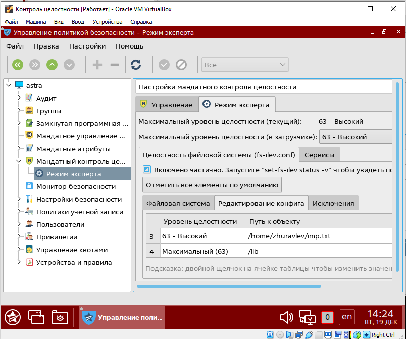

## Выполняем запись в файл из сессии с низким уровнем допуска, выходит ошибка

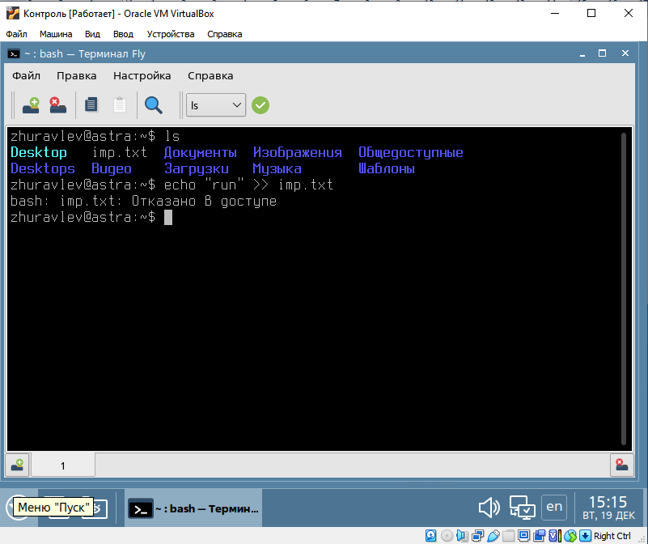

## Настраиваем замкнутую программную среду

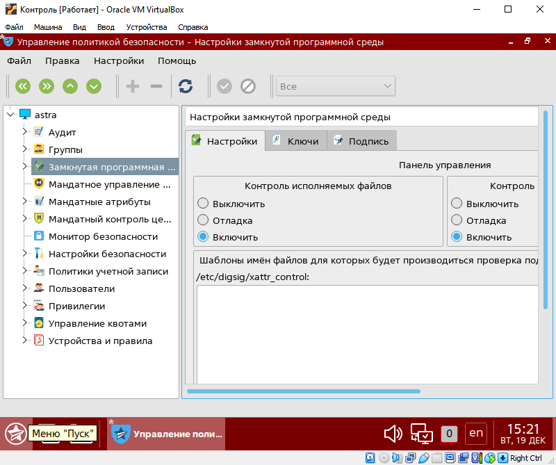

## Возьмем установщик Discord в качестве тестового файла

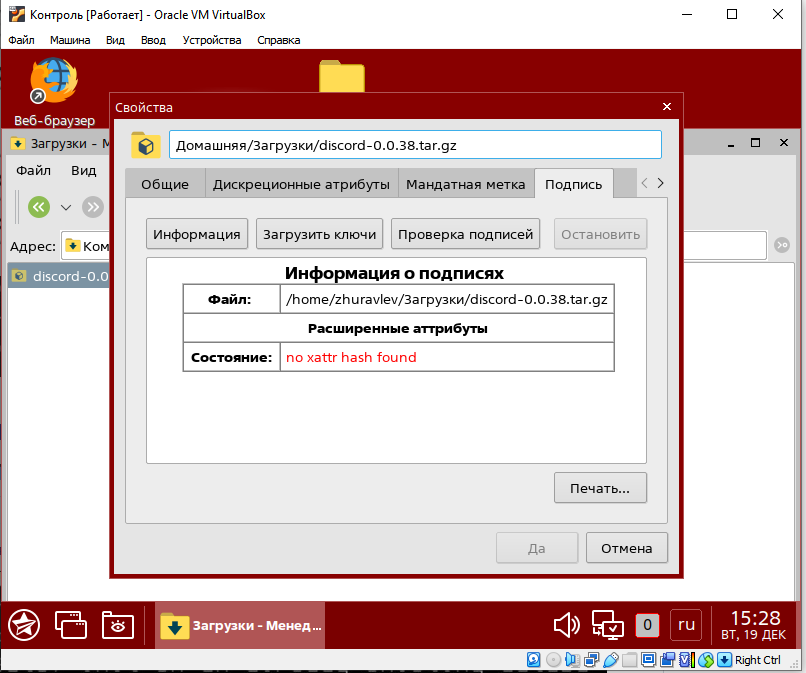

## Пробуем запустить файл, ошибка сегментирования

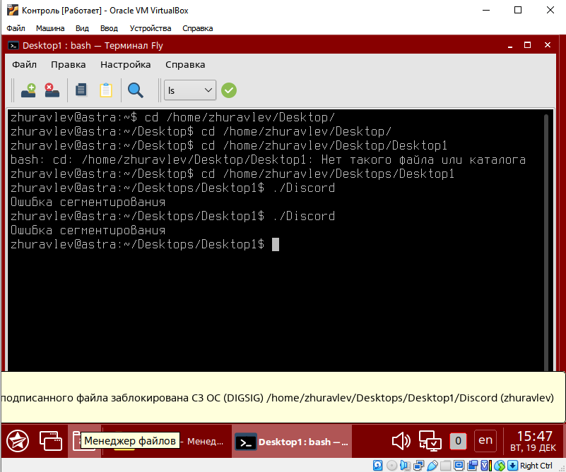

## afick - утилита, предназначенная для контроля целостности файловой системы ОС. Создание БД утилиты:

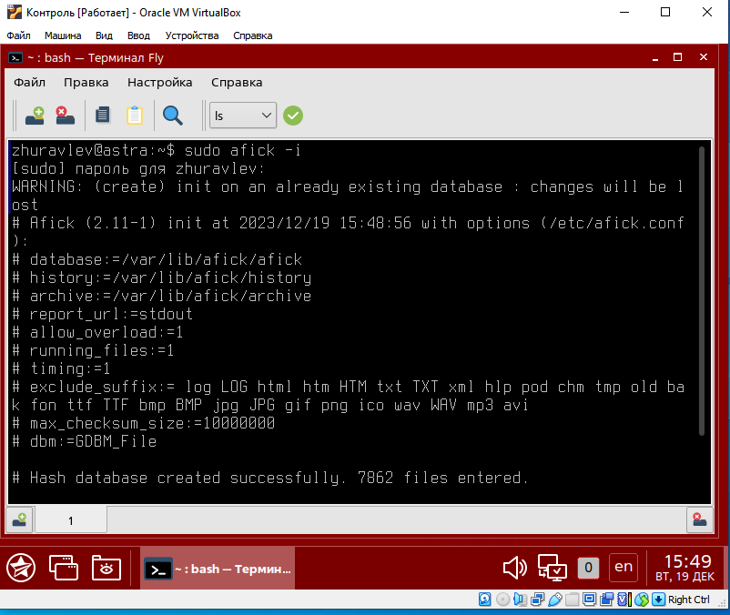

## Мониторим изменения в файловой системе, используя afick

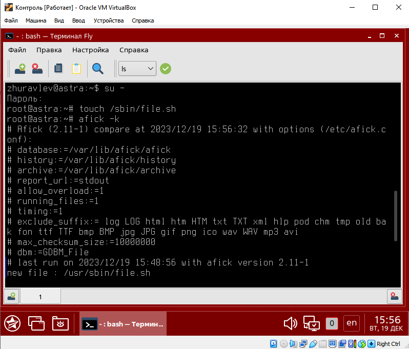
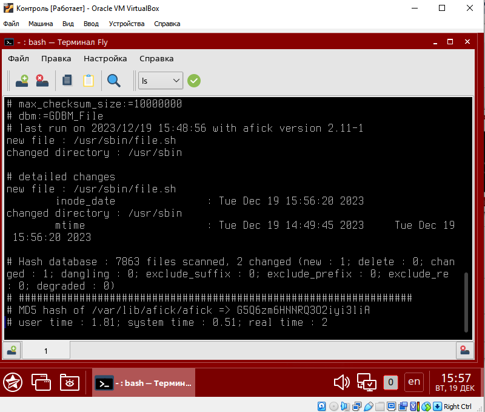
