# Практическое задание №6.2 Настройка протокола GRE

## Схема сети

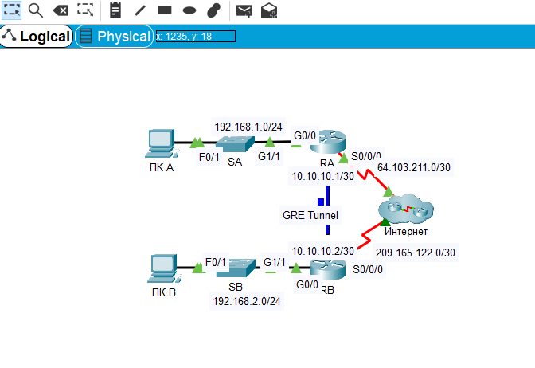

## Чтобы определить IP-адрес порта S0/0/0, отправим команду show ip int br

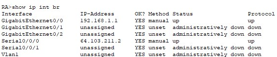

## Отправим эхо-запрос с RB на маршрутизатор RA

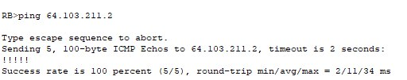

## Определяем IP адрес PCA

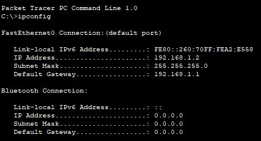

## Отправим эхо-запрос на PCA

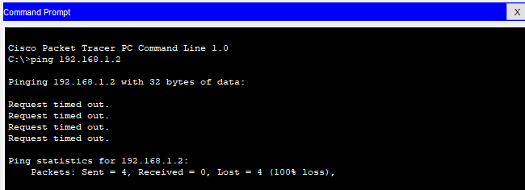

## Настройка туннеля 0 на маршрутизаторе RA

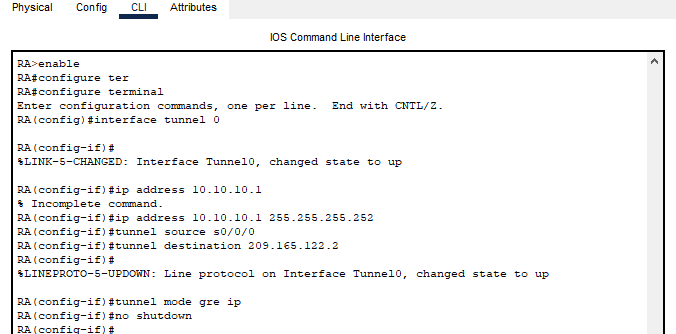

## Настройка туннеля 0 на маршрутизаторе RB

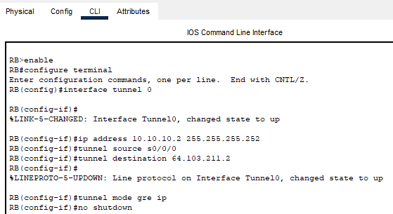

## Настроим маршрут для частного IP трафика

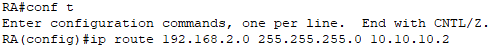
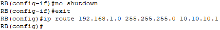

## Проверим связь между маршрутизаторами

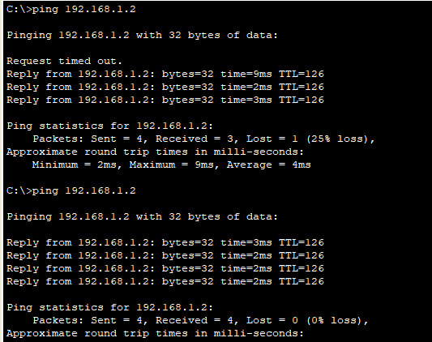

## Проверим выполнение работы

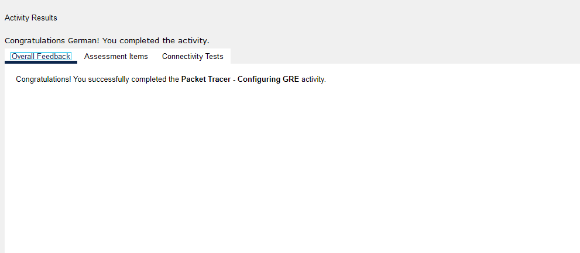
