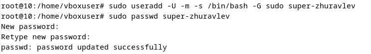
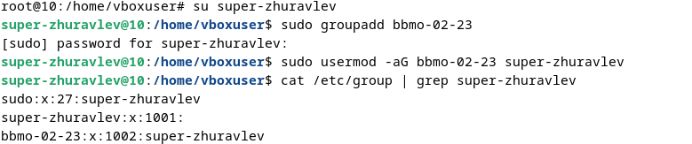
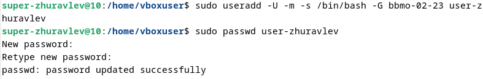
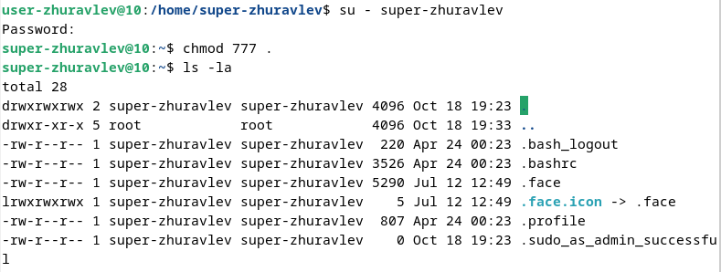
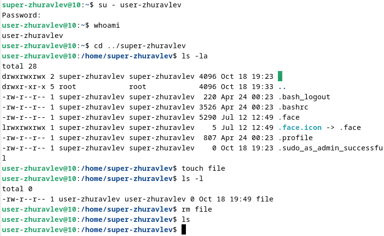

# Практическое задание №2

## Создание суперпользователя

## Создание группы `bbmo-02-23` и добавление суперпользователя в нее

## Создание пользователя с добавлением в ранее созданную группу

## Наделение пользователя полномочиями по созданию и удалению файлов в домашнем каталоге суперпользователя

## Проверка работы новых полномочий у пользователя

