# Практическое задание №3

## Виртуальные машины

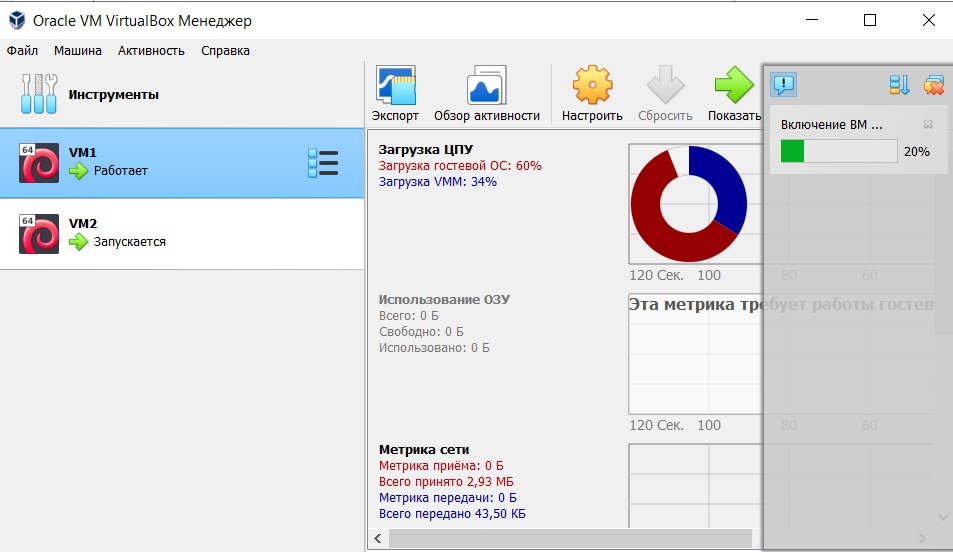

## Включить на 1й из ВМ передачу логов по протоколу rsyslog на 2ю ВМ

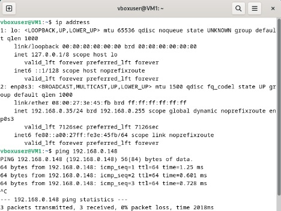
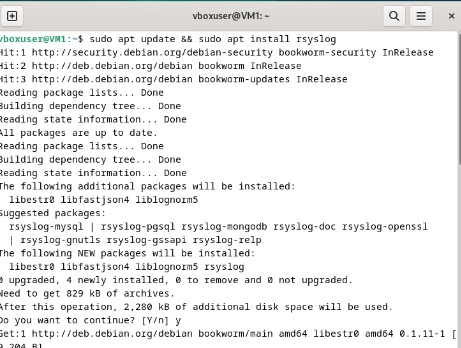
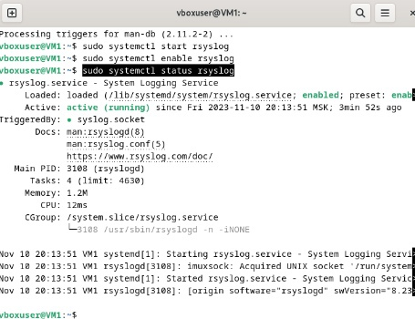
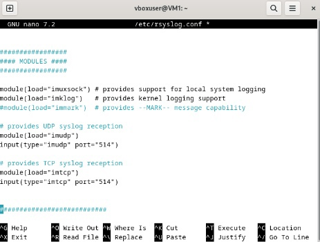
### Настройка VM2 аналогична

### Установка правил на сервер

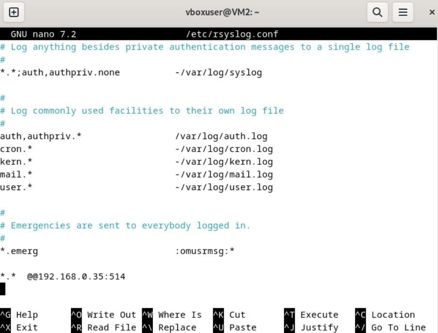

### Проверка
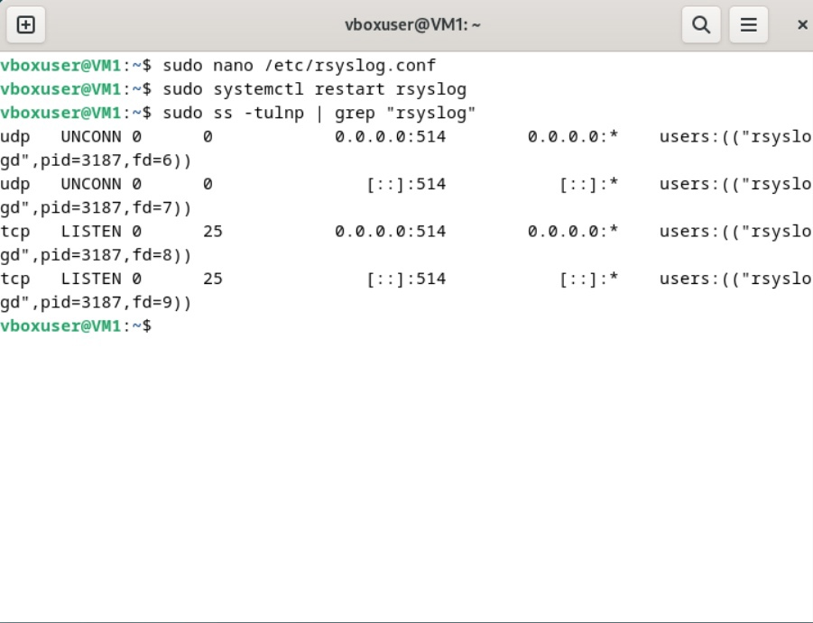
## Установить и настроить получение логов на сервер с использованием Loki
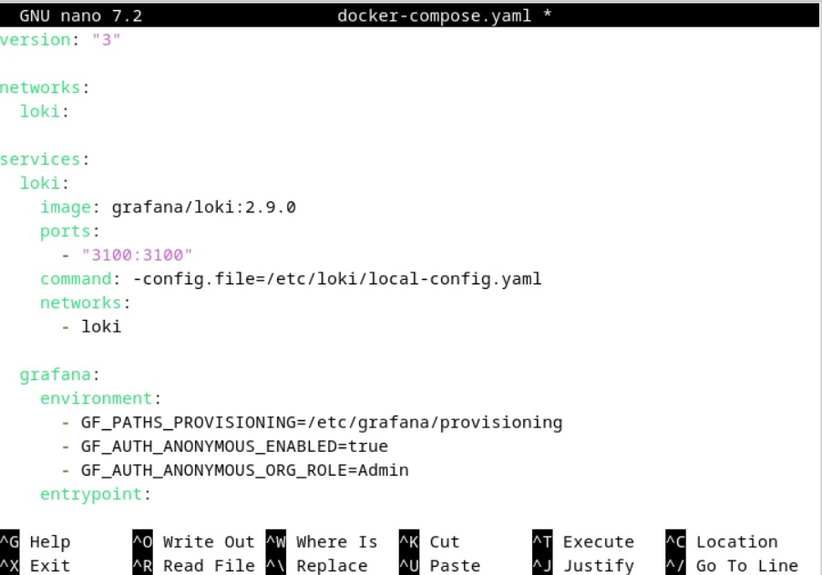
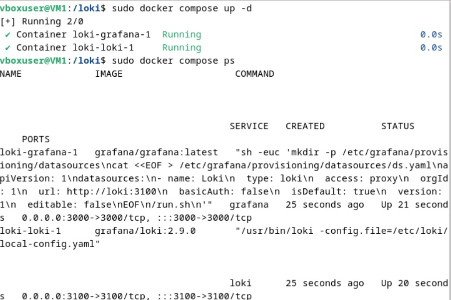
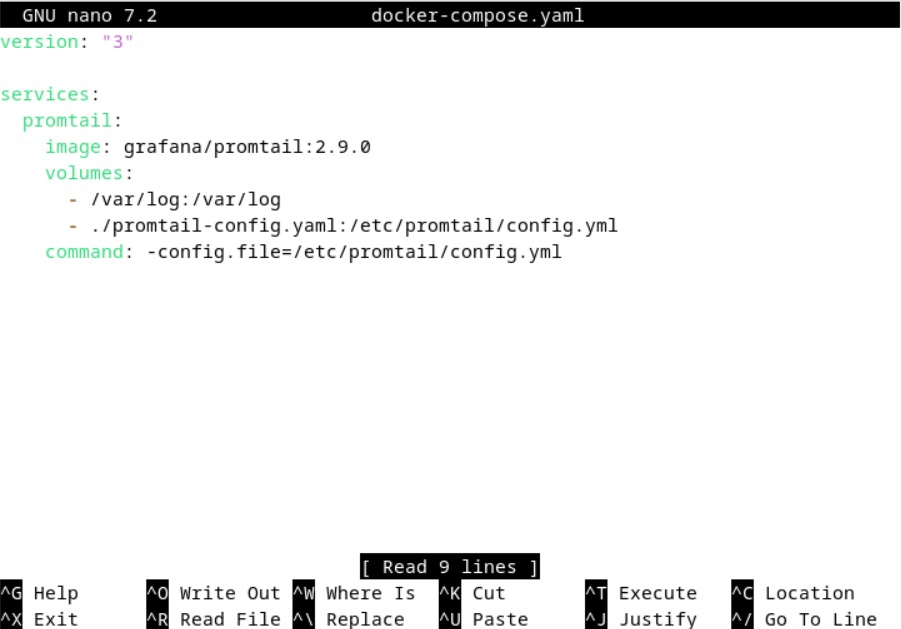
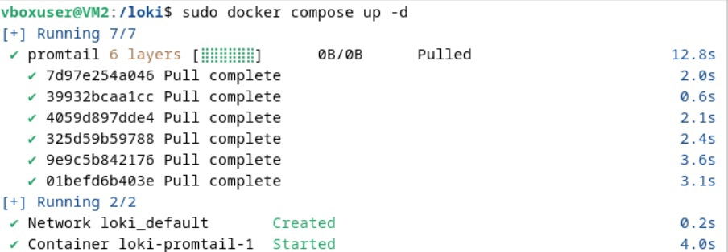
### Просмотр логов в Grafana
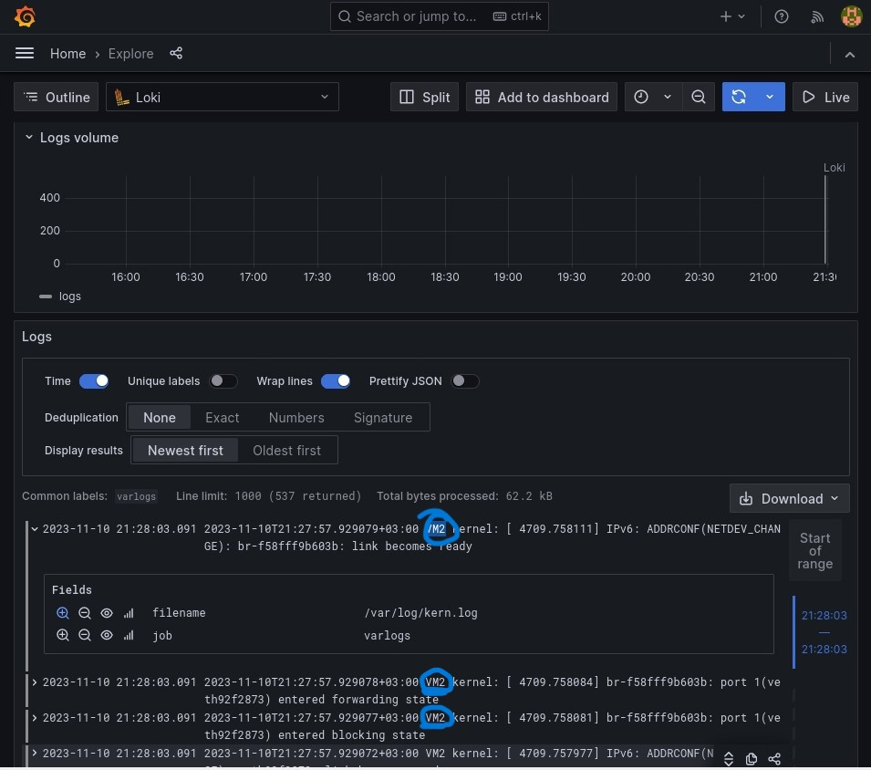
