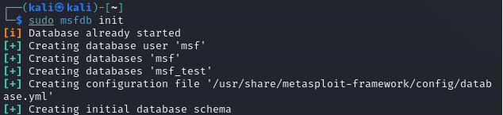
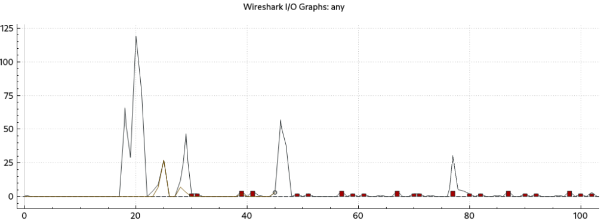

# Лабораторная работа №3 + Практическая работа №6

## Скачиваем Kali Linux и DVL

## Сканируем с помощью nmap

## Установка и запуск OpenVas

## Сканирование DVL

## Установка и запуск burpsuite

## Установка OWASP ZAP

## Запуск metasploit

## Анализ трафика с помощью Wireshark

