# Лабораторная работа №3 + Практическая работа №6

## Создание ключевой пары GPG

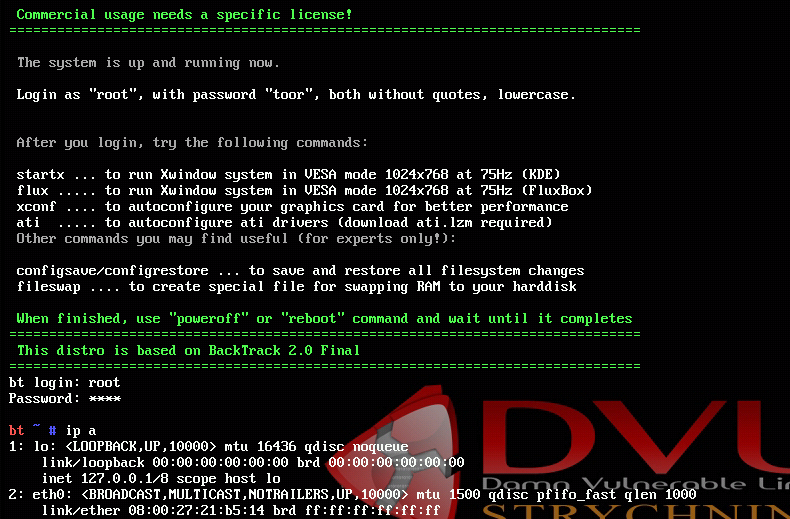
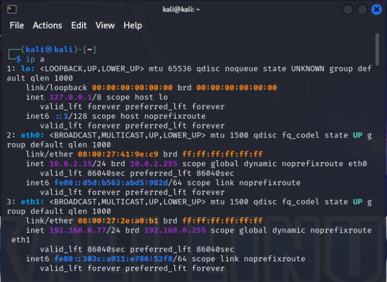

## Просмотр созданных ключей, подписей, отпечатков

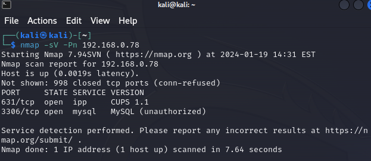

## Создание отзывающего сертификата

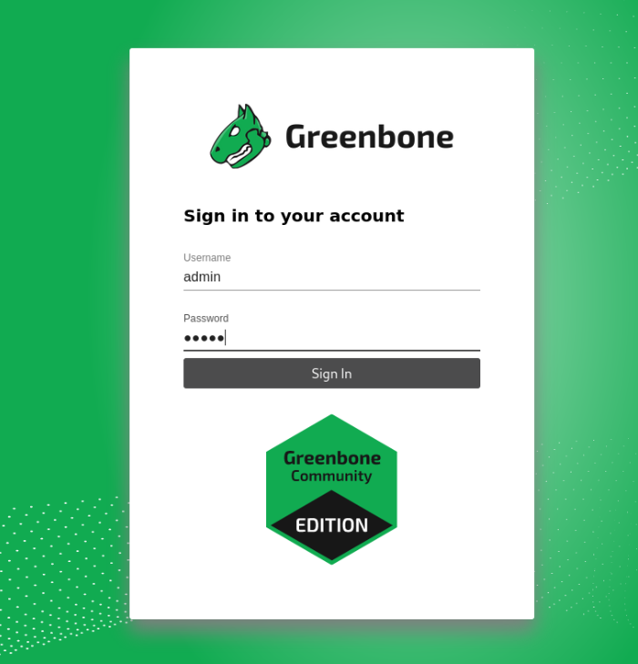

## Запись сертификата в файл

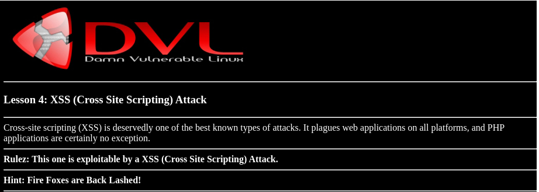

## Просмотр содержимого файла

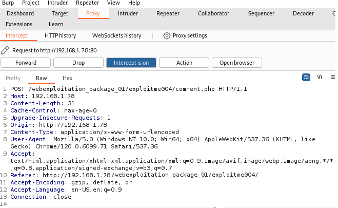

## Экспорт публичного ключа в бинарном и текстовом виде

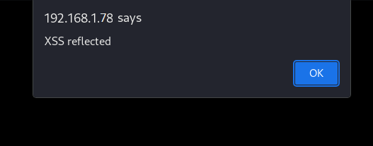
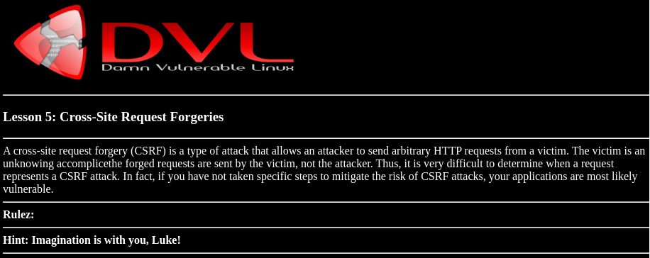
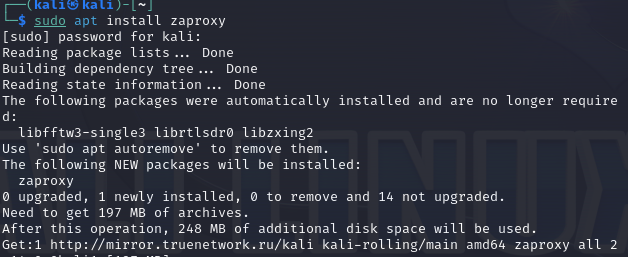

## Создание файла для подписи и создание цифровой подписи в бинарном виде
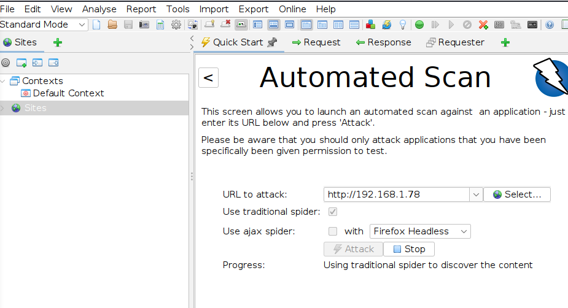

## Создание цифровой подписи в формате ASCII
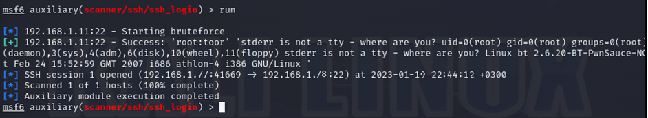

## Создание цифровой подписи, вставленной в содержимое файла
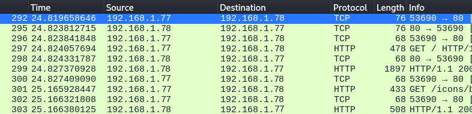
