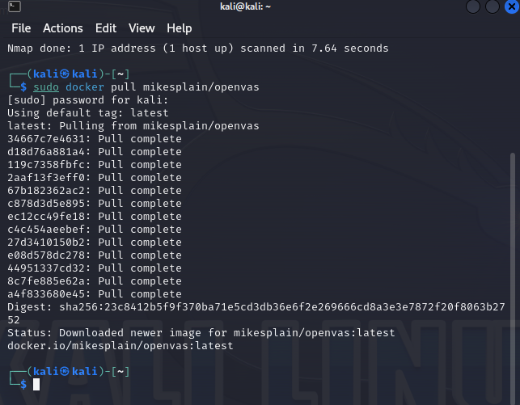

# Лабораторная работа №3 + Практическая работа №6

## Создание ключевой пары GPG

## Просмотр созданных ключей, подписей, отпечатков

## Создание отзывающего сертификата

## Запись сертификата в файл

## Просмотр содержимого файла

## Экспорт публичного ключа в бинарном и текстовом виде

## Создание файла для подписи и создание цифровой подписи в бинарном виде

## Создание цифровой подписи в формате ASCII

## Создание цифровой подписи, вставленной в содержимое файла

